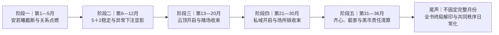

# 剧情规划线路图

> 本文件是尚未分章的施工蓝图，不是正式正典。正式长期时序以 [`story/timeline.md`](../../story/timeline.md) 为准，阶段功能以 [`story/arcs/`](../../story/arcs/_index.md) 为准，跨章必须继承的变化及完成判据以 [`story/plotlines/`](../../story/plotlines/_index.md) 为准。

## 当前实现基线

- 最近定稿章节：暂无。
- 已完成节点：暂无。
- Active 节点：暂无。
- 当前节点状态：正式剧情节点均尚未进入正文消费；已退役节点不进入后续章节候选。
- 当前结构：全书核心跨度三年，五阶段按 `5＋7＋8＋10＋6` 个月运行；尾声不是第六阶段，不固定完整月份。
- 当前关系基线：阶段一至二完成安若曦、唐雨薇、苏璃、苏晚乔、江岚与许知夏、许知秋的独立入口、关系确认与稳定回路；阶段三以后直接调用关系存量，不重新证明关系成立。

## 规划冲突

| 编号 | 类型 | 原有冲突 | 已确认调整 |
| --- | --- | --- | --- |
| C-01 | 阶段时长 | 原十二季度表到第二年 Q4 才进入阶段三后期，使阶段五实际只剩约一个季度。 | 重排为阶段一第 1—5 月、阶段二第 6—12 月、阶段三第 13—20 月、阶段四第 21—30 月、阶段五第 31—36 月。 |
| C-02 | 阶段二案件边界 | 异常下注若直接进入现场协查，会提前消费赌场与温婉职业接口。 | 阶段二只保留管理局内部材料接收、精神残留提取与同类方向显影；完整协查留阶段三。 |
| C-03 | 赌场与上层反派职责 | 赌场、云顶场所、齐心、裴家若同时拖到阶段五，会形成重复收网。 | 阶段三收赌场及赌贷执行团伙，阶段四收云顶、非法贷款与场所链，阶段五只收齐心、陆佳凝、裴家与黑市上层责任。 |
| C-04 | 顾清言解印时序 | 阶段五若直接解印，会在齐心仍能反制时暴露潜伏与证据链。 | 阶段五只关闭齐心现实反制与观察传令链，顾清言固化核心保留到尾声开端的全书终局。 |

## 主线路图

## 阶段事件粗排

### 阶段一｜第 1—5 个月

1. 以魏琳咨询、工作室、酒吧、训练馆和车行建立江州生活面。
2. 苏璃、苏晚乔分别启动独立关系，不互相取得身份和私密细节。
3. 安若曦遭遇现实越界与外来欲望干扰，晏林完成 [`PL-M-001`](../../story/plotlines/主线/人物/晏林/安若曦-外来欲望连接截断.md) 所要求的截断。
4. 安若曦取得必要风险说明，完成辞职、材料交割与现实切割，并向江岚说明最低必要事实。
5. 江岚从法律顾问与漫展相遇形成对晏林的独立认识；唐雨薇、许知夏、许知秋只完成后续关系入口。

阶段终点：苏璃、苏晚乔关系成立；安若曦完成异常后的第一次主动选择但尚未确认持续关系；江岚取得直接相关事实。

### 阶段二｜第 6—12 个月

1. 安若曦与江岚先完成必要告知和边界重谈，安若曦再于正常状态下主动确认持续关系。
2. 江岚完成独立选择、双人关系定义及三人最低互动秩序，不成为安若曦的审批人。
3. 唐雨薇向苏璃说明感情，经送车保养完成独立反向邀约；唐雨薇—晏林、苏璃—唐雨薇分别成立。
4. 许知夏、许知秋经共同生活、岗位分流和户外项目分别确认关系，并形成可重复、可暂停的共同回路。
5. 苏璃与苏晚乔继续分轨深化，双方知道关系结构非排他，但尚不正式见面。
6. 管理局内部完成 [`PL-S-006`](../../story/plotlines/副线/组织/管理局/异常下注材料与同类精神残留显影.md)：接收多名异常赌徒材料，依法提取并比对精神残留，只确认同类外来干预方向。

阶段终点：安若曦、唐雨薇、苏璃、苏晚乔、江岚与许知夏、许知秋均获得后续能够自然复现的稳定关系位置；晏林、温婉、赌场、云顶和非法贷款链尚未进入完整协查。

### 阶段三｜第 13—20 个月

1. 苏璃与苏晚乔经分别同意完成 [`PL-M-014`](../../story/plotlines/主线/人物/内圈/多线首次可见与分别继续.md)，只建立身份、称呼、排期、独处、风险与暂停的最低边界。
2. 苏璃—唐雨薇关系线形成第一次三人共同回路；安若曦—江岚关系线、苏晚乔线及双胞胎线继续保留各自日常和亲密存量。
3. 晏林以普通消费者身份进入云顶，经小鱼儿逐步接触悦悦、淼淼、娜娜、阿九与童颜；不同人物的交易、债务、梦境、求助和后果分别成立。
4. 阿九经连续三晚接触给出赌场签贷、现实侵害与转入云顶的有限方向，随后完成有限陈述、保护接入、债务与直接控制脱离及临行复选。
5. 唐家正式启动候选资格复核，唐雨薇完成车行交接并主动归家查阅本人材料。
6. 现实材料达到门槛后，温婉承担公安侧协调，晏林只承接限定能力协查；依次完成 [`PL-S-103`](../../story/plotlines/副线/人物/罗东海/赌场现场落网.md)、[`PL-S-104`](../../story/plotlines/副线/人物/罗东海/记忆复核打开赌贷团伙方向.md) 与 [`PL-S-105`](../../story/plotlines/副线/人物/章绍衡/赌贷团伙收网与章绍衡潜逃.md)。

阶段终点：罗东海与赌贷主要执行人员归案，章绍衡潜逃；赌场行动线收束，云顶、公共贷款余额、于静及场所责任留阶段四。

### 阶段四｜第 21—30 个月

1. 晏林经递名、独立审核和本人缴费进入私域，先完成 [`PL-S-099`](../../story/plotlines/副线/组织/云顶KTV/私域首次正常私人行程.md)，不把第一次私人行程写成调查踩点。
2. 私域晚会依次承接顾清言初见、杨柳拒绝、白玥越界施术与晏林完整逆流；白玥随后在清醒状态下主动复选、入案、交证并进入程序隔离。
3. 调查系统依据材料独立接触杨柳；乔宁另行完成第一次自主留宿、职业边界确认与首批材料提交。
4. 顾清言经 [`PL-S-067`](../../story/plotlines/副线/人物/顾清言/星辰之印排异发作与首次协助稳定精神之海.md) 与 [`PL-S-068`](../../story/plotlines/副线/人物/顾清言/反复止损姐弟关系与有限交底.md) 在两至三个月内形成三至四次有限止损和姐弟式有限同盟；阶段性身体关系只能发生在与发作、止损和信息交换分离的清醒窗口。
5. 楚辞经会所进入、由顾清言暂留和训练后登上云梦号；七日邮轮显出齐心、陆佳凝与裴家的跨境资源重组及人员转移方向。
6. 白玥、乔宁、私域、云顶、万安、车辆、人员和结算记录开始交叉核验；裴家剪裁甩锅被识别，新型违禁精神药剂与失踪、实验、伪造记录进入可追责串联。
7. 完成 [`PL-S-110`](../../story/plotlines/副线/组织/云顶KTV/非法贷款公共余额清零.md) 与 [`PL-S-111`](../../story/plotlines/副线/组织/云顶KTV/于静收监与云顶实体关停.md)，场所执行链不再拖入阶段五。
8. 三组核心关系簇分波取得危机必要事实，许知夏、许知秋分别取得岗位安全所需的异常知情；日常和亲密回路继续运行。

阶段终点：赌场—云顶—私域的场所层后果完成收束；齐心、陆佳凝、裴家及黑市上层责任进入阶段五。

### 阶段五｜第 31—36 个月

1. 顾清言保持带印潜伏，只在持续授权下接受精神之海稳定、对新增作用的必要截断、现实预保全和紧急撤离准备；正式程序启动后停止新增亲密。
2. 杨柳、燕舒、侯瑞驰等人分别提交自己能够证明的材料，医疗、通信、场所、结算、星表目标、境外接收和实验记录共同形成证据链。
3. 推进 [`PL-M-004`](../../story/plotlines/主线/组织/反派/核心反派责任链清算.md)：分别确认齐心的出售与实验委托、陆佳凝的境外转送、裴家的购买拘禁和实验责任，不把各主体合并成统一组织。
4. 齐心及现实执行接口失去追加控制、联系观察者、灭口和组织反制能力，会所观察与传令链被切断；阶段五只建立顾清言全书终局解印硬门槛。
5. 唐家完成候选决选。唐雨薇在确认自己有资格继承后主动支持唐雨宸，并完成食品项目责任清理与阶段性交接。
6. 白玥在案件、保护和监管关系能够独立运行后另行确认长期暗线关系；许知夏、许知秋分别接入共同秩序协商。
7. 完成 [`PL-M-007`](../../story/plotlines/主线/人物/晏林/双子星主体解释权与分层公开边界.md) 与 [`PL-M-016`](../../story/plotlines/主线/人物/内圈/长期关系共同秩序与协商成阵.md)，把必要告知、独立关系、拒绝、暂停、职业分权和危机参与落实到生活安排。

阶段终点：一条黑市责任链被拆除，齐心、陆佳凝、裴家及相关接口分别进入清算；顾清言印记核心仍在，完整解印留尾声开端。

### 尾声｜不固定完整月份

1. 在现实隔离、风险评估、授权见证、核心可辨认接触与顾清言持续授权同时成立后，回收 [`PL-S-008`](../../story/plotlines/副线/人物/顾清言/黑暗契约者-非法种印首案的隔离解印与责任分层.md)。
2. 安若曦先剥离外来控制核心，再按残存锚点分次修复既成损伤；解印不抹除顾清言的记忆、主动犯罪、长期失衡与法律责任。
3. 顾清言进入治疗、责任认定与收监离场，不回归长期关系；晏林盘下私域并终止旧黑产经营。
4. 共同秩序进入工作、吃饭、出行、留宿、独处、多人安排、拒绝和暂停等可见日常。
5. 阿九奶茶店生活及小鱼儿、娜娜、悦悦的间断性非付费私人回归只承担生活余波；最后异常星表记录不重开本书主线。

## 跨线依赖

| 上游 | 下游 | 依赖类型 | 必须保持的边界 |
| --- | --- | --- | --- |
| 安若曦截断与现实切割 | 安若曦正常状态下再次选择 | 选择权恢复 | 第一次临时亲密不能自动确认持续关系。 |
| 阶段二异常下注残留显影 | 阶段三赌场限定协查 | 方向升级 | 残留只能给方向，不能直接锁定赌场、人员或贷款链。 |
| 阿九有限陈述与其他现实材料 | 赌场现场行动 | 现实门槛 | 梦境和单一陈述不能替代现实取证。 |
| 赌场及赌贷执行团伙收束 | 云顶实体与公共余额收束 | 执行层递进 | 赌博链结束不等于场所控制、影像与人员后果消失。 |
| 私域、云顶、万安及独立交证材料交叉 | 齐心、陆佳凝、裴家责任清算 | 证据汇流 | 白玥、顾清言或单一受害者不能承担完整上游举证。 |
| 齐心现实反制失效与观察传令链切断 | 顾清言全书终局解印 | 安全硬门槛 | 阶段五不暴露、接触或剥离固化核心。 |
| 三组关系簇最低危机协作 | 长期共同秩序 | 关系递进 | 协作不产生全员共同居住、共同亲密或职业权限。 |

## 决策清单

### 现在必须决定

- 已完成：五阶段时长采用 `5＋7＋8＋10＋6` 个月。
- 已完成：阶段二只显影异常下注精神残留，不启动完整协查。
- 已完成：赌场线阶段三收束，场所链阶段四收束，齐心／裴家／黑市上层阶段五收束。
- 已完成：顾清言完整解印留到阶段五关闭反制门槛后的尾声开端。

### 阶段内决定

- 阶段三、四、五可由哪些既有日常接口承载共同任务，以及每项任务由谁发起、谁可以拒绝。
- 阶段四四个模块各自占用的章节比例与关系缓冲位置。
- 阶段五齐心、陆佳凝、裴家责任落地的具体公开顺序与视角承载。

### 单章执行时决定

- 具体章号、场景地点、对白、动作、亲密场次与详略比例。
- 每次多人安排的参与者、暂停方式、恢复条件与独处补偿。
- 调查材料在单章中的可见范围、误读方式与现实核验过程。

## 未来 3—5 章就绪队列

当前没有已登记章节、最近承接点或正式章纲。五阶段顺序已经可供后续分章，但尚不能把任何章节标记为“就绪”；首次分章应从阶段一开局的工作室日常、魏琳咨询、心动酒吧与安若曦截断中选取 3—5 章入口。

## 正式化接口

- 阶段月份范围与十二季度顺序：[`story/timeline.md`](../../story/timeline.md)。
- 阶段进入状态、终点、知情边界与禁止提前：[`story/arcs/`](../../story/arcs/_index.md)。
- 跨章必须继承的状态变化与完成判据：[`story/plotlines/`](../../story/plotlines/_index.md)。
- 具体章序、场序与执行规格：确认后进入 `story/construction/` 或单章大纲，不继续堆入本蓝图。
