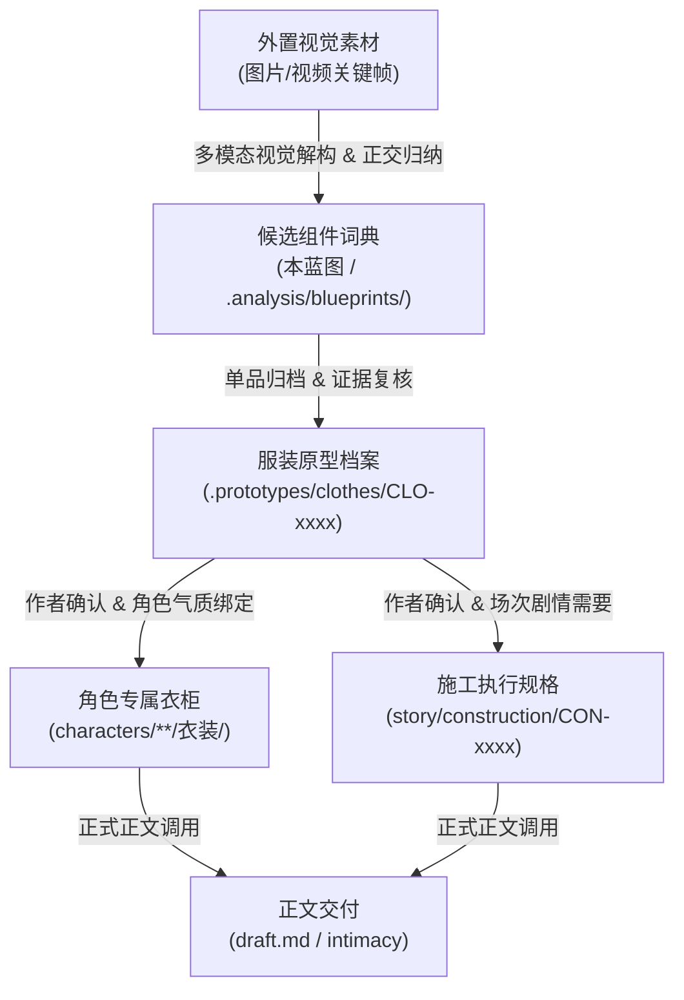

# 首批视觉素材服装组件解构与候选词典设计蓝图

> 文档定位：首批视觉素材服装组件解构、字段规范与候选词典（持久设计参考，非故事真源、非全品类）
> 归档位置：`.analysis/blueprints/服装模块化组件与视觉资产设计蓝图.md`
> 关联层级：`.prototypes/clothes/`、`characters/**/衣装/`、`story/construction/`
> 数据来源：基于 14 张静态图与 18 个视频多点关键帧的视觉解析（集中于甜辣短装、黑白蕾丝、女仆、泳装、学院风、做旧牛仔、缎面睡衣及少量新中式约二十余个可辨识造型）

---

## 目录

- [一、 蓝图定位与证据原则](#一-蓝图定位与证据原则)
- [二、 顶层架构与资产流转链路](#二-顶层架构与资产流转链路)
- [三、 正交色彩体系与表面材质矩阵](#三-正交色彩体系与表面材质矩阵)
- [四、 正交组件字段与编码规范](#四-正交组件字段与编码规范)
- [五、 首批素材候选组件解构词典 (Component Taxonomy)](#五-首批素材候选组件解构词典-component-taxonomy)
  - [1. 上装组件 (Tops)](#1-上装组件-tops)
  - [2. 下装组件 (Bottoms)](#2-下装组件-bottoms)
  - [3. 连体／私域／泳装组件 (One-Piece & Intimates)](#3-连体私域泳装组件-one-piece--intimates)
  - [4. 腿饰与鞋履组件 (Hosiery & Footwear)](#4-腿饰与鞋履组件-hosiery--footwear)
  - [5. 颈饰／头饰／手部与道具组件 (Accessories & Props)](#5-颈饰头饰手部与道具组件-accessories--props)
- [六、 物理穿脱、承重逻辑与感官叙事参考](#六-物理穿脱承重逻辑与感官叙事参考)
- [七、 风格搭配范式与组合示例 (Mix & Match)](#七-风格搭配范式与组合示例-mix--match)
- [八、 落地执行与原型库流转规则](#八-落地执行与原型库流转规则)

---

## 一、 蓝图定位与证据原则

### 1. 定位与边界
本蓝图是对当前批次外置视觉素材（14 张图片与 18 个视频）中高频造型的**模块化组件解构与候选词典**。
- **样本范围**：当前素材集中于甜辣日常短装、私域睡裙/束身衣、女仆/执事装、分体/连体泳装、学院风短裙、做旧牛仔等偏窄样本，**不代表全品类**。
- **参考属性**：本蓝图属于 `.analysis/` 分析候选层，提供正交拆解字段与候选描写词汇，不是故事真源，也不可直接替代 `.prototypes/clothes/` 独立原型档。

### 2. 证据分级标准
所有组件的描述严格区分为三个层级，杜绝把画面不可见的信息写成既成事实：
- **【画面确认】**：仅凭现有素材画面即可直接验证的视觉事实（如：领口剪裁、开衩位置、外部系带、水洗磨白、外露明线、大致颜色与光泽等）。
- **【合理推断】**：基于版型轮廓、贴身程度与物理悬垂表现所作的合理解构（如：高弹力贴身可能含氨纶、抹胸内侧通常需防滑胶条、裙身挺括通常经压褶定型等）。
- **【候选制作规格（暂不锁定）】**：小说具体描写或定制制作时可采用的参数（如：具体的毫米/厘米尺寸、精确织物混纺成分、精确丝袜 D 数、内部鱼骨根数等）。**此类信息不得作为素材解析事实**。

### 3. 叙事与去模板化原则
- 服装仅提供视觉信号、审美偏好与感官锚点。
- **严禁将服装部件与人物人格、权力关系或亲密许可做机械绑定**（如：不得将“Choker”直接等同于“从属/调教”，不得将“白月光”与“清纯与堕落”做模板化捆绑）。
- 露肤度、系带开口或摄影用途**绝不自动产生身体触碰或亲密授权**。

---

## 二、 顶层架构与资产流转链路



### 流转与脱敏规则
1. **单向流动**：素材 → 蓝图候选 → CLO 原型档（记录证据、推断与制作边界） → 作者确认 → 写入角色衣柜或 CON 施工单元。
2. **正式文件脱敏**：正式人物卡、剧情节点、`CON-*` 与正文中，**严禁引用本蓝图、组件代码（如 `TOP-CAM-01`）或原型编号（`CLO-xxxx`）**，必须转译为具体世界观内的人物衣装描写。

---

## 三、 正交色彩体系与表面材质矩阵

将色彩、材质光泽与透光层次拆分为三个相互独立的正交维度：

```text
┌─────────────────────────────────────────────────────────────┐
│ 1. 色彩角色 (Color Roles)    - 主体色 / 结构色 / 点睛色 / 阴影负空间 │
├─────────────────────────────────────────────────────────────┤
│ 2. 材质观感 (Material Finish)- 哑光 / 高光缎面 / 漆光涂层 / 粗粝织物 │
├─────────────────────────────────────────────────────────────┤
│ 3. 透光层级 (Sheer Levels)   - 不透光 / 微透透肉 / 镂空阴影 / 全透视 │
└─────────────────────────────────────────────────────────────┘
```

### 1. 色彩角色定义
- **主体色 (Primary)**：占视觉面积 60%~80% 的大基底色。
- **结构色 (Structural)**：滚边、腰封、明线、吊带、领口、拉链等骨架边缘色。
- **点睛色 (Accent)**：蝴蝶结、水钻、金属搭扣、发饰、立体胸花等局部焦点。
- **阴影与负空间 (Negative Space)**：露肤区域、蕾丝镂空形成的皮肤投影、褶皱阴影。

### 2. 首批素材高频色盘 (Primary Palettes)
| 色系代码 | 色彩名称 | 视觉表现（剥离模板化情绪标签） | 典型材质观感与对应素材 |
| :--- | :--- | :--- | :--- |
| `C-BLK-01` | **曜石黑 / 哑光黑** | 低反光、轮廓清晰收紧、纯净深沉 | 弹力棉、梭织西装布、哑光针织 |
| `C-BLK-02` | **亮面黑 / 漆光黑** | 强反光、湿润高光、硬质边缘 | 亮面涂层布、仿皮、PU |
| `C-WHT-01` | **纯白 / 珍珠白** | 明亮、反光柔和、线条利落 | 缎面醋酸、挺括衬衫棉、细平纹布 |
| `C-WHT-02` | **奶白 / 燕麦杏白** | 暖调柔和、低对比度、蓬松视觉 | 细罗纹针织、雪纺纱、软棉 |
| `C-DEN-01` | **冷洗炭黑 / 灰黑** | 水洗做旧、边缘泛灰、粗粝纹理 | 做旧水洗牛仔布（带磨白毛边） |
| `C-DEN-02` | **复古冰蓝 / 水洗浅蓝** | 浅淡冷调、清爽休闲、微磨白 | 经典水洗牛仔布 |
| `C-GRY-01` | **银灰 / 香槟冷银** | 高光流转、金属丝泽感、垂顺 | 高光缎面、丝质混纺 |
| `C-NAV-01` | **藏青 / 深海蓝** | 沉稳冷调、深色对比、古典端庄 | 挺括制服呢、厚雪纺、涤棉 |
| `C-RED-01` | **深酒红 / 勃艮第红** | 浓郁暗红、低明度高饱和、光影分明 | 亮面涂层布、丝绒、重工蕾丝 |
| `C-BLU-01` | **霁蓝 / 浅水蓝** | 清透冷调、轻盈飘逸 | 渐变雪纺薄纱、轻质丝绸 |
| `C-PNK-01` | **芭比亮粉 (Hot Pink)** | 高饱和鲜明粉、视觉冲击强 | 弹力氨纶、涂层亮面弹力布 |
| `C-PNK-02` | **茱萸粉 / 裸粉** | 低饱和灰粉、贴近肤色、温和柔润 | 哑光泳装布、轻薄蕾丝、雪纺 |

### 3. 透光与肤色交互层级 (Sheer & Skin Interaction)
*注：以下分级基于肉眼视觉透光表现，不作为出厂 D 数等内部工艺事实。*
- **Level 0（完全不透）**：厚织物、牛仔、皮革、双层棉衬，完全遮蔽肤色。
- **Level 1（微透雾面）**：极薄白纱、浅色轻针织，在强光或贴肤处呈现微弱肤色轮廓。
- **Level 2（透肉明暗）**：经典透肉黑丝/白丝观感，受力拉伸处（膝盖、大腿前侧）透出肤色，松弛褶皱处保持浓色，形成立体明暗。
- **Level 3（镂空与投影）**：花卉蕾丝、侧边系带镂空，在皮肤表面投下明确的花纹阴影或大块露肤负空间。
- **Level 4（全透视）**：单层黑色/浅色薄纱，形体与内搭轮廓完全可见。

---

## 四、 正交组件字段与编码规范

为避免将“一件完整单品”硬编码为伪组件，组件库按以下**正交维度**进行属性解构：

```text
[组件编号] = [品类 CATEGORY] - [基础款型 SUBTYPE] - [序号]
```

### 属性维度矩阵
1. **品类与款型 (Category & Subtype)**：如吊带 (CAM)、抹胸 (TUB)、衬衫 (SHT)、短裤 (SHT/DNM)、短裙 (SKT)、束身衣 (COR)、泳装 (SWM) 等。
2. **剪裁与轮廓 (Silhouette & Cut)**：领型（深V/方领/一字领/挂脖）、袖型（无袖/飞袖/泡泡袖/长袖）、腰位（超低腰/中腰/高腰）、长度（露脐/超短/及膝/及踝）。
3. **开合与承重结构 (Fastening & Support)**：套头、后背排扣、前襟拉链、挂脖系绳、侧边绑带（注意：区分装饰性系带与承重结构）。
4. **材质观感 (Material Appearance)**：哑光棉麻、做旧牛仔、高光缎面、亮面仿皮、轻薄雪纺、立体蕾丝。
5. **色彩分配 (Color Scheme)**：主体色 + 结构色 + 点睛色。
6. **表面工艺与饰件 (Surface Craft & Accessories)**：压褶、毛边、金属鸡眼、水钻字母、荷叶边、刺绣。
7. **证据状态 (Evidence Level)**：画面确认 / 合理推断 / 候选制作规格。

---

## 五、 全品类素材候选组件解构词典 (Component Taxonomy)

---

### 1. 上装组件 (Tops)

#### (1) 吊带与挂脖类 (Camisoles & Halters)
- **【TOP-CAM-01】极细双肩带短背心**
  - **画面确认**：极细平直肩带（1~2mm），大方领或低U领，大面积展露锁骨与上胸，露脐短款。
  - **合理推断**：高弹贴身面料（如双层弹力棉或混纺罗纹），靠弹性维持平整。
- **【TOP-CAM-02】挂脖露背式背心**
  - **画面确认**：系带绕过颈后固定，前襟深V或梯形包裹，背部肩胛骨与腰线上部完全展露。
- **【TOP-CAM-03】后背多重交叉绑带背心**
  - **画面确认**：正面为简洁抹胸或吊带款，背面由多条细带呈“X”形交错拉紧，底端系蝴蝶结。
- **【TOP-CAM-04】不对称单斜肩上衣**
  - **画面确认**：仅单侧有肩带（配立体花饰或金属环装饰），另一侧为平直抹胸边缘。
- **【TOP-CAM-05】法式睫毛蕾丝边纯欲细吊带 (田曦薇风)**
  - **画面确认**：奶白/纯白方领，领口与双肩带边缘满镶细腻法式睫毛蕾丝，初恋纯欲无防备感。
- **【TOP-CAM-06】米白千层荷叶边花瓣挂脖背心 (毛晓彤风)**
  - **画面确认**：米白/浅奶粉色层叠荷叶边花瓣挂脖雪纺背心，领口为一圈温润小珍珠串链，背后系带。

#### (2) 抹胸与裹胸类 (Tube Tops & Bandeau)
- **【TOP-TUB-01】一字极简弹力抹胸**
  - **画面确认**：无肩带平口包裹，短款露腹，贴合胸廓线条。
- **【TOP-TUB-02】亮面仿皮硬质抹胸**
  - **画面确认**：酒红或黑色亮面质感，表面挺括有一定反光，前中或侧边有金属拉链。
- **【TOP-TUB-03】前胸系结飘带抹胸**
  - **画面确认**：前胸中央由雪纺或缎面布料打结固定，两条飘带垂在胸腹部，后背微露。
- **【TOP-TUB-04】坦桑石蓝立体水滴宝石抹胸罩杯 (白欣禾风)**
  - **画面确认**：深海蓝立体宝石与水滴钻密集镶嵌，下摆垂落银蓝垂直流苏链，细宝石肩带。
- **【TOP-TUB-05】芭比粉多巴胺亮面抹胸 (纸鱼风)**
  - **画面确认**：高饱和亮粉色漆皮/防水高光面料，后背搭配荧光粉安全搭扣绑带与微型腰包。
- **【TOP-TUB-06】甜美卡通猫脸水钻抹胸 (小哈娜风)**
  - **画面确认**：纯白弹力棉抹胸，胸前印有卡通猫脸与立体水钻蝴蝶结，甜酷少女风。

#### (3) 衬衫、罩衫、针织与西装类 (Shirts, Knits & Blazers)
- **【TOP-SHT-01】宽松男友风系结白衬衫**
  - **画面确认**：大版型白衬衫，解开上方纽扣露出领口与内搭，衣摆在腰腹处打结缩短。
- **【TOP-SHT-02】正统短款水手短袖衬衫**
  - **画面确认**：白色挺括短袖，水手大翻领，搭配深色丝带领结，下摆短于常规衬衫。
- **【TOP-SHT-03】半透明轻薄防晒罩衫**
  - **画面确认**：超薄透光长袖，前襟单扣或系带，内搭轮廓完全透视可见。
- **【TOP-SHT-04】纯白氧气落肩纯棉衬衫 (章若楠风)**
  - **画面确认**：棉麻质感，落肩宽松剪裁，微敞领口露出内搭白色蕾丝背心，极致白月光初恋感。
- **【TOP-KNT-01】大版斜肩软针织衫**
  - **画面确认**：大领口滑落露单侧肩膀，长袖盖住大半手掌，下摆过臀，宽松下垂。
- **【TOP-KNT-02】极简纯黑修身高领长袖打底衫 (大锤风)**
  - **画面确认**：极简薄款贴身高领，完美勾勒胸腰起伏，冷静克制与禁欲冷淡感。
- **【TOP-KNT-03】粉糯短袖针织开衫配粉白鸵鸟羽毛 (杨雨潼风)**
  - **画面确认**：软糯浅粉短袖开衫，胸前点缀立体粉白鸵鸟羽毛与珍珠小扣，甜美治愈。
- **【TOP-KNT-04】深紫高领削肩露脐罗纹毛衣背心 (林霸天风)**
  - **画面确认**：深紫色高弹罗纹针织，高领削肩无袖剪裁，大露香肩，下摆露脐。
- **【TOP-BLZ-01】纯白大翻领廓形休闲西装外套 (李一桐风)**
  - **画面确认**：宽松垫肩大翻领，内搭深V透光蕾丝吊带，单颗贝壳圆扣，干练与妩媚兼备。
- **【TOP-BLZ-02】黑色缎面收腰荷叶边长袖西装衬衫 (琳园长风)**
  - **画面确认**：修身高腰剪裁，衣摆微散开荷叶边，深V翻领，大女主气场。
- **【TOP-BLZ-03】水墨扎染做旧廓形先锋西装外套 (陈瑶风)**
  - **画面确认**：水泥灰与水墨扎染重磅大廓形西服（落肩双排扣），胸口别重工立体黑缎山茶花与垂落黑藤蔓，清冷大女主。
- **【TOP-LEA-01】赛博廓形机车皮衣夹克 (九言风)**
  - **画面确认**：硬质黑色重磅皮革，宽大落肩廓形，配银色大纽扣与金属拉链。

#### (4) 运动、体操与瑜伽塑形上装 (Athleisure & Gym Tops)
- **【TOP-SPT-01】宽底边减震运动 Bra 背心 (朱珠风)**
  - **画面确认**：雾霾蓝/冷灰，高弹吸汗面料，黑色撞色加宽下围弹力带，U型大领口。
- **【TOP-SPT-02】极简立领修身拉链运动短夹克**
  - **画面确认**：纯黑高弹速干面料，修身短款，敞开拉链露出内部运动Bra。
- **【TOP-SPT-03】白色无袖大露背瑜伽背心 (母其弥雅风)**
  - **画面确认**：超大圆领、后背工字挖空大露背，纯棉透气。
- **【TOP-COS-06】经典日系白红撞色短袖体操服 (安田风)**
  - **画面确认**：纯白短袖棉质T恤，猩红圆领与红袖口滚边，胸前日文平假名印花，青春动感。

#### (5) 新中式、古典仙侠、盛典华服与 Cosplay 类 (Traditional, Couture & Anime)
- **【TOP-CHI-01】月白暗纹提花立领中袖短衫 (陈瑶马面裙风)**
  - **画面确认**：新中式改良立领，双层月白真丝提花暗纹，过肘中袖，搭配高腰黑色马面裙。
- **【TOP-CHI-02】水蓝荷叶边挂脖肚兜式上衣**
  - **画面确认**：浅水蓝/冰蓝雪纺，前襟带有层叠荷叶边微翘，颈部与腰后细绳系结，大露背。
- **【TOP-CHI-03】薄纱半透视欧根纱立领旗袍 (李沁风)**
  - **画面确认**：浅水绿欧根纱，高立领斜襟，胸肩半透视薄纱，满绣重工立体花卉与碎钻。
- **【TOP-CHI-04】藏青棉麻中式盘扣长袖武术短袍 (施梦露风)**
  - **画面确认**：宽松藏青棉麻，对襟盘扣，衣袖飘逸，挥动油纸伞时极具女侠身段。
- **【TOP-CHI-05】月白提花水滴镂空短袖改良旗袍裙 (陈瑶宋风)**
  - **画面确认**：立领微泡泡短袖，胸口水滴镂空配珍珠扣，胸身满绣米白暗花，端庄典雅。
- **【TOP-XIA-01】纯白雪纺双层大袖仙侠襦裙 (刘亦菲风)**
  - **画面确认**：广袖流云，素白如雪，风吹时衣袂翩跹，发髻配银簪与珍珠发网。
- **【TOP-XIA-02】敦煌草书印花蝉翼大袖披帛装 (陈瑶CCTV春晚风)**
  - **画面确认**：香槟金/米黄渐变轻纱大袖，满印草书墨迹书法，内搭淡鹅黄抹胸配琥珀蜜蜡项链。
- **【TOP-XIA-03】天青蓝晕染齐胸襦裙 (陈瑶浪姐蓝羽水仙风)**
  - **画面确认**：冰蓝/天青渐变雪纺，胸前拼接透视蓝纱与白蕾丝，配重工织锦腰封与蓝宝石锁骨链。
- **【TOP-COS-01】红金樱花刺绣和风硬质抹胸 (河野华花火风)**
  - **画面确认**：猩红与金边樱花刺绣，硬质托胸抹胸，搭配手腕多重猩红中国结细绳与狐仙面具。
- **【TOP-COS-02】玄黑金纹云雷短外褂 + 乳胶连体衣 (走路摇少司缘风)**
  - **画面确认**：玄黑真丝暗纹短袍（金云雷纹滚边），内搭纯白高光乳胶连体衣，背负青碧色悬浮光翼环。
- **【TOP-COS-04】鸣潮雪绒机能战姬抹胸 (走路摇雪绒风)**
  - **画面确认**：纯白黑金硬质皮甲抹胸（中缀深蓝绸缎花与金铃），配双臂纯白蕾丝长手套与蓝紫星空披风。
- **【TOP-COS-05】深海塞壬幻彩贝壳鳞片倒三角抹胸 (小玥玥风)**
  - **画面确认**：幻彩粉蓝贝壳亮片密集镶嵌，鱼尾倒三角下摆，挂脖贝壳链，垂落微型珍珠流苏。

---

### 2. 下装组件 (Bottoms)

#### (1) 牛仔短裤与热裤类 (Denim Shorts & Hotpants)
- **【BOT-DNM-01】侧边金属鸡眼交叉系带牛仔短裤**
  - **画面确认**：冷洗灰黑或浅蓝做旧牛仔，超短低腰剪裁，侧臀镂空开口并以金属鸡眼穿插深灰/同色系带；下摆带磨白毛边。
- **【BOT-DNM-02】多排金属纽扣高腰牛仔短裤**
  - **画面确认**：门襟纵向排列 4~5 颗复古金属扣，高腰收腹，侧边弧形微翘。
- **【BOT-DNM-03】超低腰翻边牛仔短裤**
  - **画面确认**：低腰卡胯版型，裤腿有固定翻折边，正面拉链配单金属扣。
- **【BOT-SWM-03】纯白高腰超短沙滩热裤 (纸鱼风)**
  - **画面确认**：纯白低裆超短热裤，腰侧挂银白水晶细链，搭配芭比粉泳装。
- **【BOT-COS-02】猩红高衩高弹运动体操短裤 Bloomers (安田风)**
  - **画面确认**：猩红色高弹力包臀短裤，超高衩剪裁，裤腿与腰部弹性收口，极致展露臀腿线条。

#### (2) 裙装、马面裙、针织裙与洛可可裙摆类 (Skirts, Knits & Couture Bustles)
- **【BOT-SKT-01】高腰硬挺百褶短裙 (JK/女团风)**
  - **画面确认**：锋利定型压褶，走动时裙摆自然散开，长度位于大腿中部偏上。
- **【BOT-SKT-02】弹力微开衩紧身包臀超短裙**
  - **画面确认**：贴合腰臀曲线，单侧或双侧带微型开衩，裙摆齐大腿上三分之一。
- **【BOT-SKT-03】层叠蕾丝蛋糕蓬蓬短裙**
  - **画面确认**：2~3 层黑色或白色蕾丝荷叶边层叠，蓬松立体，下摆轻盈。
- **【BOT-SKT-04】白色水钻字母装饰短裙**
  - **画面确认**：纯白短裙，侧边或腰侧有闪光水钻拼成的字母图案装饰。
- **【BOT-SKT-05】法式复古粉黑波浪长裙摆 (陈都灵风)**
  - **画面确认**：樱花粉真丝雪纺，边缘饰以黑色蕾丝花边与黑色缎带蝴蝶结，席地铺展。
- **【BOT-SKT-06】银光亮片闪粉流苏短裙 (走路摇战袍风)**
  - **画面确认**：高腰侧开叉，满镶反光亮片与垂坠银线流苏，旋转时流光溢彩。
- **【BOT-SKT-07】洛可可粉黑不对称前短后长大裙摆 (陈都灵洛可可风)**
  - **画面确认**：前摆高挑露出粉黑蕾丝短裤与修长美腿，后摆如波浪散开，边缘满镶黑蕾丝与粉蝴蝶结。
- **【BOT-KNT-01】深紫高腰包臀单侧微开衩针织短裙 (林霸天风)**
  - **画面确认**：深紫色紧身罗纹针织短裙，高腰包臀，左大腿侧带有 3cm 微型开衩。
- **【BOT-COS-01】纯白超短侧开衩燕尾短裙 (走路摇雪绒风)**
  - **画面确认**：纯白高腰侧开衩短裙，背后延展出长燕尾与白绒毛大斗篷。
- **【BOT-MAM-01】纯黑重工织银山水马面裙 (陈瑶风)**
  - **画面确认**：纯黑挺括面料，高腰宽腰封系带，前后裙门满织银线山水楼阁暗纹，走动时裙摆如折扇开合。

#### (3) 裤装与运动紧身裤类 (Pants & Leggings)
- **【BOT-PNT-01】黑色修身高垂感微喇西裤**
  - **画面确认**：大腿收紧勾勒腿型，膝盖以下微散开，配高跟鞋大幅延展腿长。
- **【BOT-PNT-02】纯白高腰阔腿亚麻度假长裤 (sunny风)**
  - **画面确认**：高腰抽绳宽松垂坠，透气防晒，搭配游艇开襟衬衫与比基尼。
- **【BOT-PNT-03】高光黑亮面阔腿马面西裤 (陈瑶先锋风)**
  - **画面确认**：高光亮黑面料，宽松阔腿压褶，配水墨廓形西装极具先锋气场。
- **【BOT-SPT-01】高腰无痕裸感紧身瑜伽裤 (朱珠/葛征风)**
  - **画面确认**：雾霾蓝/纯白/曜石黑，超高腰收腰提臀，完全贴合腿臀起伏，无侧边缝线。
- **【BOT-SPT-02】高腰齐根弹力运动短裤 (母其弥雅风)**
  - **画面确认**：火龙果粉/玫红高弹速干短裤，紧裹臀部，极致展露大腿全貌。

---

### 3. 连体／私域／泳装／盛典礼服组件 (One-Piece, Intimates, Swimwear & Gowns)

#### (1) 蕾丝束身衣、私密内衣、链条比基尼与睡裙 (Corsets, Chains & Lingerie)
- **【INT-COR-01】黑色花卉镂空蕾丝束身吊带短裙**
  - **画面确认**：托胸硬杯剪裁，腰腹部为透视黑色花纹蕾丝并带有纵向结构压线，下摆带蕾丝花边；可配吊袜带扣。
- **【INT-COR-02】紫黑配色连体短装**
  - **画面确认**：黑色底布结合紫黑重工透视蕾丝拼接，领口与裤脚带细腻睫毛蕾丝边。
- **【INT-COR-03】洛可可樱花粉硬质鱼骨束腰抹胸 (陈都灵风)**
  - **画面确认**：樱花粉硬质塑形鱼骨，前中金属排扣，抹胸边缘镶黑蕾丝与大粉缎带蝴蝶结，极尽纤细蜂腰。
- **【INT-BRA-01】海梦风深V聚拢蕾丝无钢圈内衣组**
  - **画面确认**：纯白深V前扣无钢圈内衣，配同款极细双侧绑带蕾丝丁字裤（T-back），胸前深蓝黑细领带。
- **【INT-CHN-01】纯银细金属链条镂空私密比基尼 (葛征风)**
  - **画面确认**：完全由银色细金属环、连接扣与细链条交织构成的纯镂空三角挂脖罩杯，配同款细金属链挂胯丁字裤，无织物覆盖，冰凉冷艳。
- **【INT-SLP-01】深V大露背雪纺睡裙**
  - **画面确认**：黑色轻薄雪纺，前胸深V开口，胸下有一圈透光蕾丝拼接带，后背大面积镂空至腰线。
- **【INT-SLP-02】高光缎面细吊带睡衣短裤两件套**
  - **画面确认**：银灰或香槟浅色，表面呈现高反光水滑缎面光泽，极细吊带小背心配侧开衩短裤。

#### (2) 泳装与度假沙滩类 (Swimwear)
- **【SWM-ONE-01】裸杏色高开衩连体泳衣**
  - **画面确认**：裸色/浅杏色高弹泳布，大U领，细双肩带，髋骨两侧超高开衩剪裁，大露背。
- **【SWM-ONE-02】粉色立体花饰斜肩连体泳衣**
  - **画面确认**：茱萸粉色，单侧肩部缀饰多朵立体粉色雪纺花瓣，斜肩不规则剪裁。
- **【SWM-BIK-01】多巴胺彩虹渐变比基尼**
  - **画面确认**：粉/黄/蓝等渐变色，前胸大蝴蝶结打结抹胸（中缀热带花饰），配浅色低腰沙滩短裤。
- **【SWM-BIK-02】湖水绿极细挂脖比基尼 (sunny风)**
  - **画面确认**：纯正绿松石/湖水绿细带三角杯比基尼，外搭纯白大衬衫。
- **【SWM-BIK-03】法式红白格纹雪纺短罩衫 + 樱桃印花绑带比基尼 (小水一号风)**
  - **画面确认**：红白细格纹轻薄长袖短罩衫（前胸系带微透），配奶白底鲜红樱桃低腰双侧系带比基尼。

#### (3) 盛典高定晚礼服 (Evening & Pageant Gowns)
- **【GWN-EVN-01】重工满钻深V人鱼抹胸礼服 (白欣禾选美风)**
  - **画面确认**：极细水钻双肩带、深V开至胸骨、前胸与腰身满镶密实立体银白水晶/碎钻与珍珠刺绣、下摆微喇鱼尾拖地。
- **【GWN-EVN-02】粉色星光立体花瓣抹胸公主裙 (付慧琳生日风)**
  - **画面确认**：重工粉色雪纺花瓣层叠大摆，胸前密镶碎钻，梦幻奢华。
- **【GWN-EVN-03】璀璨海沫银鳞人鱼披风长裙 (陈瑶乘风之夜风)**
  - **画面确认**：单侧斜肩立体银花、满镶银亮片与反光水晶人鱼鳞纹、后肩延伸出 2 米银光刺绣长披纱（Cape），包臀拖尾。
- **【GWN-EVN-04】港风复古重工正红亮片挂脖长裙 (王楚然风)**
  - **画面确认**：正红色满亮片挂脖露背，肩臂缠绕红玛瑙珠链，胸前缀饰立体红缎花朵。
- **【GWN-EVN-05】希腊女神香槟粉大V领垂坠雪纺长裙 (陈都灵油画风)**
  - **画面确认**：大V领细双肩带，超轻真丝雪纺自然捏褶垂坠，阳光透射柔光半透视，静谧优雅。
- **【GWN-EVN-06】森系香槟银立体镂空花瓣吊带礼服 (祝绪丹风)**
  - **画面确认**：胸口花瓣形镂空领口满镶珍珠与细钻，中央立体四瓣宝石花，双肩极细水晶吊带，森林仙女气韵。
- **【GWN-EVN-07】一字肩高开衩黑天鹅水舞长裙 (格格风)**
  - **画面确认**：纯黑一字肩大露锁骨紧身上衣，右腿超高开衩飘逸雪纺大裙摆，水上舞蹈轻盈翻飞。

#### (4) 角色扮演与重工战袍类 (Maid & Costumes)
- **【COS-MAD-01】经典黑白短款女仆装**：黑色荷叶边泡泡袖短裙 + 白色打褶围裙（背后系大蝴蝶结）+ 白色荷叶边发箍。
- **【COS-MAD-02】藏蓝飞袖刺绣双层女仆裙**：深海藏青色翻领底裙（配领结），双层白色蕾丝飞袖围裙（围裙角有金色刺绣图案）。
- **【COS-WAR-01】红黑水钻战袍亮片流苏短裙 (走路摇NBPL风)**：红黑重工抹胸战袍，胸口满钻，侧腰绑带镂空，下摆银亮片流苏，气场霸道。

---

### 4. 腿饰与鞋履组件 (Hosiery & Footwear)

#### (1) 丝袜与腿饰 (Hosiery)
- **【HOS-BLK-01】透肉黑色连裤丝袜 (透光度 Level 2)**：大腿与膝盖受拉伸处透出肉粉色，脚踝与未拉伸处浓黑，光影渐变明显。
- **【HOS-BLK-02】黑色蕾丝花边及膝大腿袜**：袜口为宽幅黑色花卉蕾丝边，紧密贴合大腿上方，可与吊袜带连接。
- **【HOS-PUR-01】深紫色蕾丝花边及膝大腿丝袜 (林霸天风)**：袜口为高弹深紫花卉宽蕾丝边，袜身呈现微透肉粉深紫光泽。
- **【HOS-WHT-01】奶白微透哑光丝袜 (透光度 Level 1~2)**：温润奶白光泽，微微透出皮肤底色，呈现柔光质感。
- **【HOS-WHT-02】纯白纯棉长筒堆堆袜 / 运动及膝袜**：厚实不透光白棉，袜口带有黑色运动标，搭配老爹鞋。
- **【HOS-WHT-03】纯白高弹过膝皮袜配天蓝皮扣环 (走路摇雪绒风)**：大腿根部天蓝皮质圈环与金线勒肉，极具二次元机能感。
- **【HOS-SHT-01】白色半透明薄纱短袜**：薄纱质感，长度至脚踝上方，袜口卷边。

#### (2) 鞋履类 (Footwear)
- **【SH-BOT-01】米白／黑色厚底高筒靴**：厚底粗跟（视觉明显增高），靴筒紧贴小腿至膝下，侧边纵向拉链。
- **【SH-BOT-02】纯白尖头粗跟皮短靴 (二次元战姬风)**：纯白哑光皮面，尖头修饰脚型，侧拉链。
- **【SH-HIL-01】黑色一字带细高跟凉鞋**：脚趾处单根极细横带，脚踝细扣带，细高跟，大面积展露脚背与足弓。
- **【SH-HIL-02】Christian Louboutin 红底黑漆皮尖头细高跟鞋 (琳园长风)**：10cm 超细鞋跟、经典猩红鞋底、漆黑鞋面、女王气场。
- **【SH-LF-01】黑色厚底金属扣乐福鞋**：亮面皮革外观，鞋面金属马衔扣，厚底齿轮底。
- **【SH-MRJ-01】黑色漆皮玛丽珍鞋**：亮面反光鞋面，圆头/方头，脚背单根搭扣皮带。
- **【SH-TRN-01】复古拼接德训鞋 / 纯白厚底运动老爹鞋**：皮革拼接网布，厚底增高，活力动感。
- **【SH-CV-01】经典猩红白边高帮运动帆布鞋 (体操风)**：红白撞色帆布鞋，白色系带，平底橡胶底。

---

### 5. 颈饰／头饰／手部道具与特种配件组件 (Accessories & Unique Props)

| 编号 | 组件名称 | 视觉与材质细节 | 证据状态 | 描写参考功能 |
| :--- | :--- | :--- | :--- | :--- |
| **`ACC-CHK-01`** | **黑色皮质心形扣 Choker** | 黑色皮质圈带，中央串联镂空银色心形金属环，后颈搭扣 | 画面确认 | 视觉锁喉焦点、暗黑/辣妹风格元素 |
| **`ACC-CHK-02`** | **双层冷银金属锁骨链** | 一细一粗两条金属银链叠戴，贴合锁骨凹陷 | 画面确认 | 现代街头、高光提亮 |
| **`ACC-CHK-03`** | **密集碎钻宽版奢华 Choker (白欣禾风)** | 3cm 宽密集排列仿钻水钻排链，闪耀夺目 | 画面确认 | 选美盛典、名媛晚宴、红毯高贵焦点 |
| **`ACC-CHK-04`** | **深海蓝丝绒镂空银杏流苏颈圈 (九言风)** | 宝蓝丝绒带，悬挂金色镂空银杏叶与珍珠细链垂至胸前 | 画面确认 | 国风仙侠、二次元奢华 Cosplay |
| **`ACC-CRN-01`** | **精巧水晶钻冕皇冠 (选美/生日风)** | 银白冷光水晶/粉钻群镶弧形王冠，固定于高发髻 | 画面确认 | 颁奖礼仪、公主/女王身份、庆典焦点 |
| **`ACC-CRN-02`** | **金色机巧额饰 + 镂空长耳坠 (走路摇少司缘风)** | 额前金色菱形机甲额环，双侧悬垂细金链 | 画面确认 | 仙侠神性、机巧神官造型 |
| **`ACC-CRN-03`** | **深海冰蓝珊瑚贝壳立体发冠 (小玥玥风)** | 蓝水晶珠串流苏、晶莹透明鱼鳍羽翼耳挂垂至胸前 | 画面确认 | 深海塞壬、人鱼海妖奢华发饰 |
| **`ACC-ARM-01`** | **密集碎钻宽版臂环 + 水钻手背连指链 (小玥玥风)** | 左右大臂佩戴宽水钻臂环，手腕连指细水钻手背链 | 画面确认 | 异域舞姬、深海人鱼奢华肢体饰品 |
| **`ACC-FLW-01`** | **重工立体黑色缎面山茶花胸花 (陈瑶风)** | 黑缎立体山茶花，带长黑色枝蔓藤蔓垂落至腰下 | 画面确认 | 先锋西装胸口视觉重心 |
| **`ACC-MSK-01`** | **和风红白黑纹狐仙面具 (河野华风)** | 传统狐狸彩绘面具，系红色流苏挂绳，斜戴于发侧 | 画面确认 | 和风魅魔、神秘祭典氛围 |
| **`ACC-ROS-01`** | **猩红中国结编织指腕绳链 (河野华风)** | 红色编织细绳缠绕手腕至指尖，手背结蝴蝶结 | 画面确认 | 视觉束缚感、灵动纤手引导 |
| **`ACC-JWL-01`** | **红玛瑙珠串缠臂链 (王楚然风)** | 多圈深红玛瑙珠链缠绕右上臂，点缀金隔珠 | 画面确认 | 港风复古贵妇、浓颜奢华点缀 |
| **`ACC-JWL-02`** | **重工蓝宝石雕花多层锁骨链 (陈瑶浪姐风)** | 银雕花卉托座镶嵌水滴蓝宝石，多层垂挂锁骨 | 画面确认 | 国风仙女、舞台视觉核心 |
| **`ACC-HAT-01`** | **黑色蕾丝猫耳发箍** | 细发箍包裹黑布，双耳为镂空黑蕾丝骨架 | 画面确认 | 角色扮演、可爱/俏皮氛围 |
| **`ACC-HAT-03`** | **白色荷叶边蕾丝发箍 (喀秋莎)** | 纯白蕾丝多层打褶，双侧垂下白色系带 | 画面确认 | 女仆/执事主题发饰 |
| **`ACC-HAT-04`** | **毛边大檐草编度假遮阳帽 (sunny风)** | 天然拉菲草手工编织，帽檐拉丝毛边，随性法式度假 | 画面确认 | 海滨阳光、游艇出海、防晒慵懒 |
| **`ACC-HAT-05`** | **黑色磨砂质感小恶魔弯角发箍 (林霸天风)** | 磨砂树脂立体弯角，固定于细黑发箍 | 画面确认 | 魅魔/暗黑主题私密派对 |
| **`ACC-HAT-06`** | **甜美卡通猫耳空顶遮阳帽 (小哈娜风)** | 樱花粉色帽檐，白色帽身印卡通猫耳与粉蝴蝶结 | 画面确认 | 甜妹少女街头防晒 |
| **`ACC-SUN-01`** | **荧光粉窄框太阳镜 (纸鱼风)** | 芭比粉色粗边框，黑色防紫外线镜片 | 画面确认 | 多巴胺辣妹、夏日水上派对 |
| **`ACC-GLV-01`** | **黑色半指镂空蕾丝手套** | 覆盖小臂至手背，指节露出，蕾丝织花 | 画面确认 | 仪式感、哥特复古视觉 |
| **`ACC-GLV-02`** | **纯白半透蕾丝长手套 (走路摇雪绒风)** | 覆盖手掌至大臂中段，臂中段配金色金属圈环固定 | 画面确认 | 二次元战姬、高贵神圣感 |
| **`ACC-GLV-03`** | **黑色透视蕾丝绑带手套 (陈都灵洛可可风)** | 纯黑蕾丝手腕绑带手套，手背系黑色缎带细结 | 画面确认 | 法式宫廷、洛可可洋娃娃风 |
| **`ACC-PRP-01`** | **黑色编织软皮手持短拍/短鞭** | 黑色皮质编织手柄，末端散开软皮条，便携尺寸 | 画面确认 | 私密互动、节奏感与触碰道具 |

---

## 六、 物理穿脱、承重逻辑与感官叙事参考

在正文与场景描写中，严禁出现“衣服瞬间消失”或“违反物理结构的一拽全脱”等失真描写。必须遵循以下**真实物理结构与穿脱逻辑**：

```text
┌─────────────────────────────────────────────────────────────┐
│ 1. 外层解除 (Outer Release)  - 褪去长披风 / 披帛 / 罩衫 / 西服  │
├─────────────────────────────────────────────────────────────┤
│ 2. 结构调节 (Fastening Ease) - 解开马面裙腰带 / 调节系带 / 拉下拉链 │
├─────────────────────────────────────────────────────────────┤
│ 3. 承重解除 (Support Release)- 链条搭扣解开 / 排扣释放 / 失去张力 │
├─────────────────────────────────────────────────────────────┤
│ 4. 感官与声音显影            - 金属链冰凉碰撞 / 丝缎滑落 / 皮肤温差│
└─────────────────────────────────────────────────────────────┘
```

### 1. 典型特种部件的真实物理动作锚点
1. **纯金属细链条比基尼 (`INT-CHN-01`)**：
   - **真实物理**：颈后与后腰靠微型合金龙虾扣闭合。接触初体感极度冰凉，随着体温传递逐渐升温；解开龙虾扣时有细微的金属链环相互碰撞与滑落声（“丁零”轻响），完全顺从重力滑落。
2. **重工刺绣马面裙 (`BOT-MAM-01`)**：
   - **真实物理**：马面裙是由两片重叠围裹的裙片组成，主要靠长腰带在腰间缠绕两圈打结固定。解开外层蝴蝶结并拉开宽腰封后，重叠的裙门因失去束缚而自然向两侧散开露出内衬。
3. **海沫银鳞长披纱礼服 (`GWN-EVN-03`)**：
   - **真实物理**：披纱通常通过肩头隐形按扣或与斜肩结构缝合固定；走动或被风吹起时产生极轻的流纱摆动，若需卸下披风，需先松开肩头固定暗扣。
4. **侧边交叉系带短裤 (`BOT-DNM-01`)**：
   - **真实物理**：侧边系带承担的是大腿侧围的微调，并非整条裤子的主承重闭合扣。解开蝴蝶结活结并挑松系绳后，仅产生**侧缝局部的松弛与扩大露肤**；裤子仍需通过门襟主扣及拉链方能彻底脱卸。

---

## 七、 风格搭配范式与组合示例 (Mix & Match)

通过正交组件自由搭配不同场景的视觉造型（*注：以下范式仅为视觉组合示例，不绑定人物既定人格或剧情授权*）：

### 范式 1：【千禧甜辣街头风 (Y2K Dance)】
- **上装**：`TOP-TUB-01` 芭比粉亮色弹力抹胸
- **下装**：`BOT-DNM-01` 炭黑侧边系带做旧牛仔短裤
- **鞋履**：`SH-BOT-01` 米白厚底高筒拉链皮靴（光腿）
- **配饰**：`ACC-CHK-02` 双层冷银金属锁骨链

### 范式 2：【私域全金属冷艳组 (Metallic Boudoir)】
- **内衣**：`INT-CHN-01` 纯银细金属链条镂空比基尼（挂脖罩杯 + 挂胯丁字裤）
- **配饰**：`ACC-CHK-01` 黑色皮质心形扣Choker + `ACC-PRP-01` 编织短鞭
- **视觉特征**：银白金属光泽与纯裸肌肤形成极强反差，冰冷触感与体温交织。

### 范式 3：【新中式古典书香名媛 (Neo-Classical Mamian)】
- **上装**：`TOP-CHI-01` 月白暗纹提花立领中袖短衫
- **下装**：`BOT-MAM-01` 纯黑重工织银山水马面裙
- **鞋履**：`SH-LF-01` 黑色漆皮乐福鞋 / 绣花缎面鞋
- **视觉特征**：黑白素雅，清冷文雅，腰身挺拔，书卷气浓厚。

### 范式 4：【乘风舞台海沫人鱼仙子 (Couture Mermaid)】
- **礼服**：`GWN-EVN-03` 璀璨海沫银鳞人鱼披风长裙（满钻微型亮片 + 2米长披纱）
- **配饰**：`ACC-JWL-02` 重工蓝宝石雕花多层锁骨链 + `ACC-CRN-01` 水晶钻冕
- **鞋履**：`SH-HIL-01` 银色水钻一字带细高跟凉鞋
- **视觉特征**：如同深海人鱼破浪而出，流光溢彩，波光粼粼。

### 范式 5：【多巴胺水上乐园甜辣组 (Dopamine Summer)】
- **上装**：`TOP-TUB-05` 芭比粉亮面抹胸（配后背腰包）
- **下装**：`BOT-SWM-03` 纯白高腰超短沙滩热裤（腰侧挂水钻细链）
- **腿饰/鞋履**：`HOS-WHT-02` 纯白及膝运动袜 + `SH-TRN-01` 纯白厚底运动老爹鞋
- **配饰**：`ACC-SUN-01` 荧光粉窄框太阳镜

### 范式 6：【港风复古浓颜大女主 (Hong Kong Glamour)】
- **礼服**：`GWN-EVN-04` 港风复古重工正红亮片挂脖长裙
- **配饰**：`ACC-JWL-01` 红玛瑙珠串缠臂链 + 猩红发带
- **鞋履**：`SH-HIL-02` Christian Louboutin 红底黑漆皮尖头细高跟鞋
- **视觉特征**：正红与深黑红底鞋辉映，明艳高贵，压迫感十足。

### 范式 7：【学院风与私房解构 (Academy & Intimate JK)】
- **上装**：`TOP-SHT-02` 短款水手短袖衬衫 / `INT-BRA-01` 纯白深V蕾丝无钢圈内衣
- **下装**：`BOT-SKT-01` 天蓝白红格百褶短裙 + 侧绑带T-back丁字裤
- **腿饰**：`HOS-WHT-02` 纯白长筒棉袜 / `HOS-BLK-01` 透肉黑丝
- **鞋履**：`SH-LF-01` 黑色厚底金属扣乐福鞋

---

## 八、 落地执行与原型库流转规则

### 1. 从素材到原型档的建档规则
1. 从外置素材（`/Volumes/Alpha/R/服装` 等）提取衣装时，**必须先去重、核对画面证据与推断**。
2. 确认需要独立建档的衣装，依据 `.prototypes/clothes/_template.md` 从 `CLO-xxxx` 逐一建立标准文档，存入 `daily/`、`intimate/`、`swimwear/`、`cos/` 等对应目录。
3. 原型档必须明确记录 `画面确认`、`合理推断` 与 `暂不锁定`，不得照搬未验证的规格。

### 2. 向正式文件转译的规则
1. **角色衣柜**：经作者确认长期拥有或跨场调用的具体衣装，将已收敛的视觉特征与材质描写重新写入 `characters/**/<人物>/衣装/<服装名>.md`，并登记到同目录 `_index.md`；只有跨衣装稳定成立的审美与组合语法才写入 `_GRAMMAR.md`。
2. **场次施工**：服务于具体剧情节点的衣装执行规格，重新写入对应 `story/construction/` 下的 `CON-*`。
3. **彻底脱敏**：**正式文件（正文、大纲、CON、角色卡）不得反向引用本蓝图、组件代码或 CLO 编号**。
