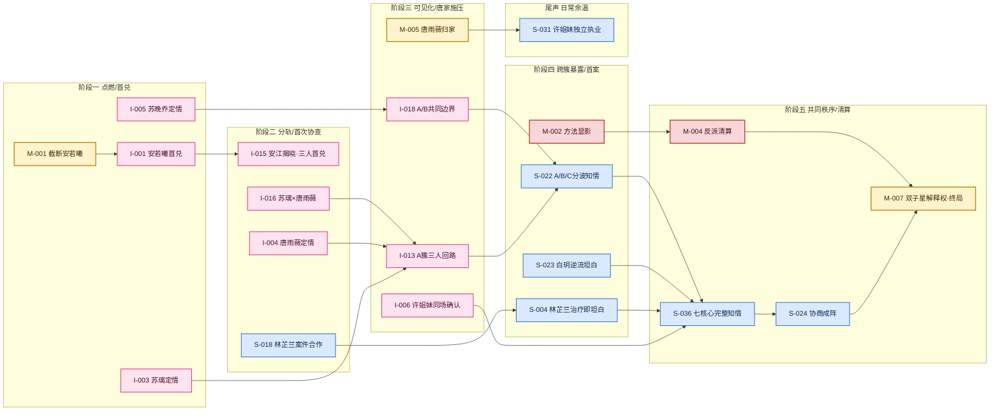
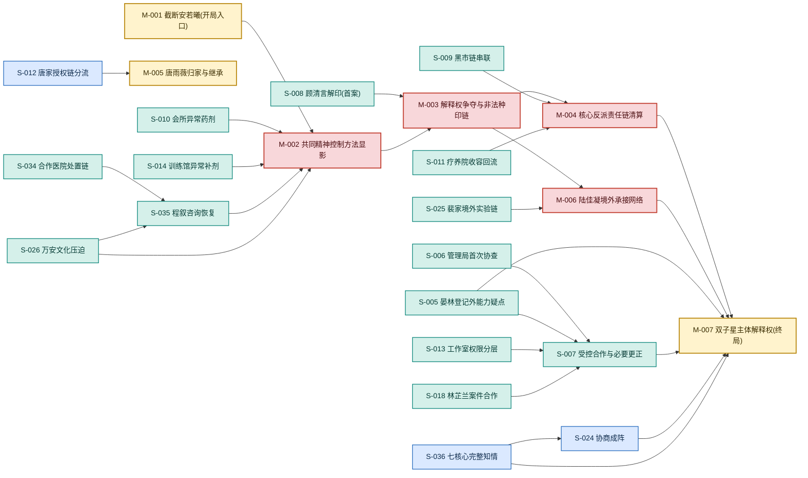
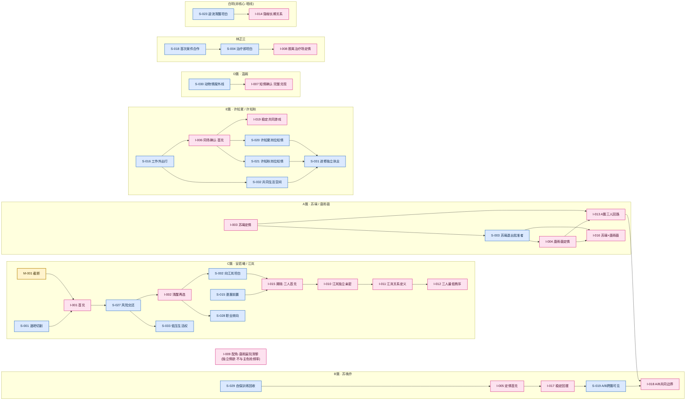
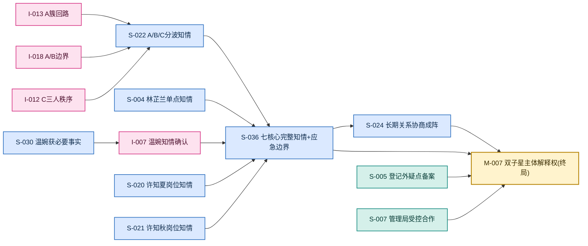

# 剧情线分层子图

> 施工/分析层可视化,不是正典。节点事实以 [`story/plotlines/`](../../story/plotlines/_index.md) 为准,阶段以 [`story/arcs/`](../../story/arcs/_index.md) 为准。
>
> 总图见 [剧情线总关系图](剧情线总关系图.md);本页把它拆成 4 张各自可读的子图。
> 颜色约定同总图:🟡主体 / 🔴反派 / 🩷亲密 / 🔵关系副线 / 🟢案件制度。连线为依赖/推进方向。

---

## 子图 1 · 总览泳道(里程碑级)

只保留每簇每阶段的关键里程碑,看"整体怎么走、在哪里合流"。

---

## 子图 2 · 主线脊柱 + 案件产业链

看"核心矛盾怎么从散案汇成解释权终局"。案件旁证(青)向上喂给反派主线(红),制度侧(S-005/S-007)与关系侧总闸(S-036/S-024)在终局 M-007 合流。

---

## 子图 3 · 亲密线五簇 + 独立线

看"每条关系怎么按 知情/现实(蓝) → 兑现(粉) → 稳定/升级 推进",以及五簇之间的跨簇点。

---

## 子图 4 · 内圈分波 → 成阵 → 终局

看"分散的关系知情怎么两级汇聚成终局解释权"。关系侧走 分波(S-022)→ 七核心完整知情(S-036)→ 成阵(S-024);制度侧走 S-005/S-007;两路在 M-007 合并。**七核心 = 苏璃/唐雨薇/苏晚乔/安若曦/江岚/温婉/林芷兰**;许姐妹、白玥、配角不在此序列。

---

## 与真源同步约定

- 子图与总图共用同一套推断阶段;`story/arcs/` 完成章节分配后需回来校准。
- 连线为依赖方向可视化,不改写任何节点"后续接口"字段;冲突以正式节点为准。
- 节点增删/退役时同步更新总图、子图与 [`_status/`](../../story/plotlines/_status/)。
