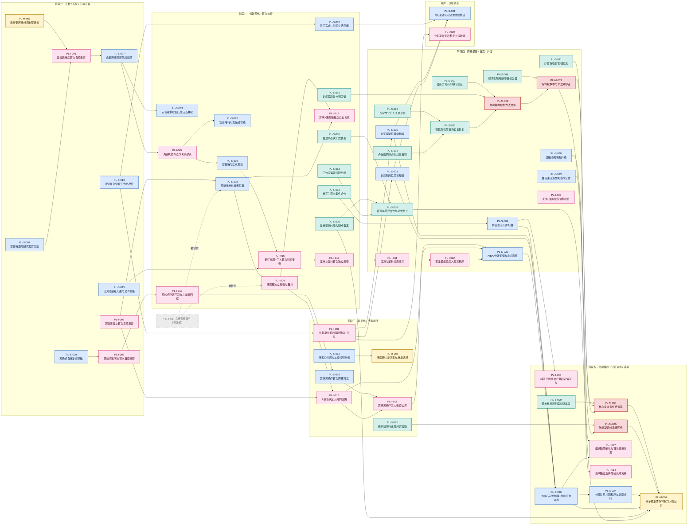

# 剧情线总关系图

> 本页是施工/分析层可视化,不是正典。节点事实以 [`story/plotlines/`](../../story/plotlines/_index.md) 正式节点为准,阶段调用以 [`story/arcs/`](../../story/arcs/_index.md) 为准。
>
> **列 = 阶段(怎样走)**:从左到右为阶段一→尾声。多数 pending 节点标注"待章节大纲分配",此处按其"节点定位/备注"暂放到最可能阶段,仅供纵览;正式阶段以 arcs 分配为准,不得当作已确认事实。
>
> **颜色 = 线路类型**;**连线 = 依赖/推进方向(怎样关联)**,箭头由上游指向下游。

## 图例

| 颜色 | 含义 | 编号 |
| --- | --- | --- |
| 🟡 金 | 主线·主体(晏林/唐雨薇) | `PL-M-001/005/007` |
| 🔴 红 | 主线·反派链 | `PL-M-002/003/004/006` |
| 🩷 粉 | 亲密线(兑现) | `PL-I-*` |
| 🔵 蓝 | 副线·关系/生活/职业 | `PL-S-*` |
| 🟢 青 | 副线·案件/制度/黑产/场域 | `PL-S-*` |
| ⚪ 灰虚线 | 已退役 | `PL-S-017` |

## 总图

## 怎么读这张图

1. **横向 = 时间推进**。同一簇的关系从左向右,基本都是"现实事件/知情(蓝) → 亲密兑现(粉) → 稳定/升级"的节奏,体现"知情自愿在先、能力不介入感情"的设计铁律。
2. **五条亲密簇各成一串**,汇入右侧两个收束点:
   - `PL-S-036`(七核心完整知情)——七位核心女主(苏璃/唐雨薇/苏晚乔/安若曦/江岚/温婉/林芷兰)的知情汇流。
   - `PL-S-024`(协商成阵)——把临时危机协作沉淀为可持续的共同秩序。
   - 两者最终都指向终局节点 `PL-M-007`(双子星主体解释权)。
3. **案件产业链(青)自成一路**:黑市/会所/裴家/万安/合作医院/程叙等旁证 → `PL-M-002`(方法显影) → `PL-M-003`(解释权争夺) → `PL-M-004`/`PL-M-006`(清算/境外网络) → `PL-M-007`。这条线与亲密簇几乎不交叉,只在终局解释权处合流。
4. **两个汇聚枢纽**最值得盯:`PL-M-007` 入度最高(终局总收束),`PL-S-036` 是关系侧的知情总闸。
5. **孤点**:`PL-I-009`(配角唐雨宸×阮清黎)刻意不与主色带连接;`PL-S-017` 已退役,虚线标出它把职责交给 `PL-I-004`/`PL-S-003`。

## 与真源同步约定

- 本图**位置(阶段)为推断**,`story/arcs/` 完成正式章节分配后需回来校准列归属。
- 本图**连线为依赖方向的可视化**,不新增或改写任何节点事实;若与正式节点"后续接口"字段冲突,以正式节点为准。
- 节点增删或退役时,同步更新本图与 [`_status/`](../../story/plotlines/_status/) 状态表。
