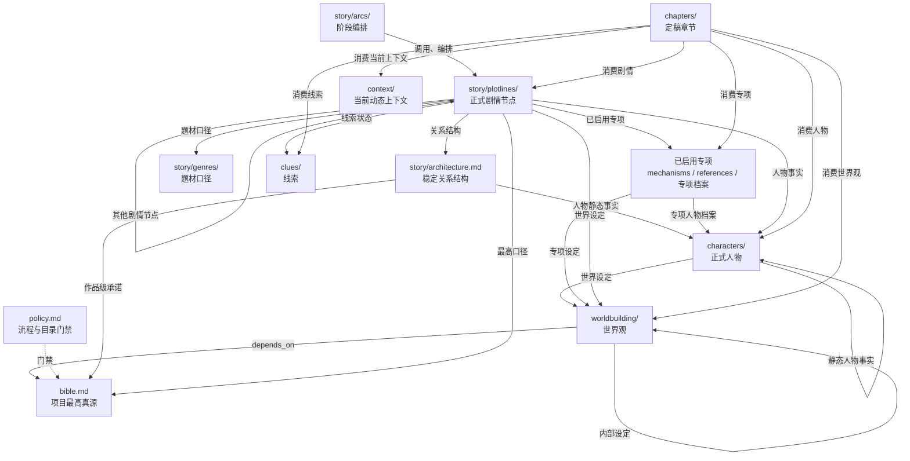
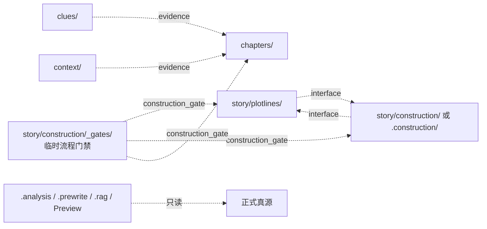
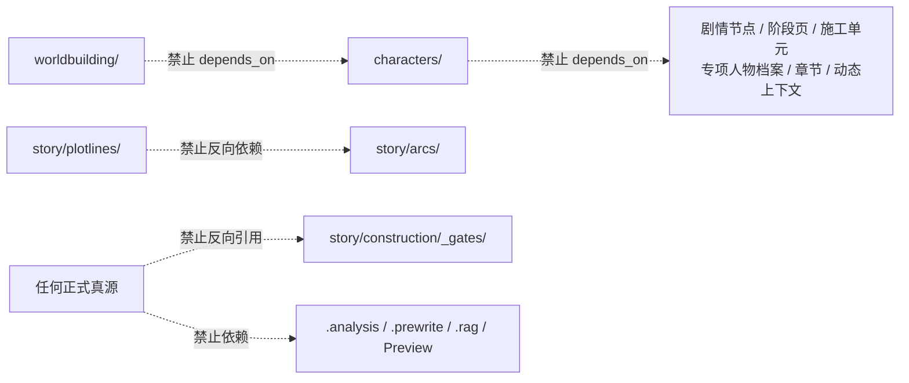

# 项目引用方向说明

> 本页是项目目录引用关系的辅助说明图，不保存故事事实，也不构成正式真源或新增规则。
> 引用类型与允许方向以 `policy.md` 与 `story-writer://rules/core/正式真源引用方向` 为准；若本页与正式真源或 runtime 规则冲突，以后者为准。

## 怎样读图

- `A --> B` 表示 A 引用并依赖 B，即 B 是 A 的上游真源。
- 实线表示 `depends_on`，参与依赖环检查。
- 虚线表示 `interface`、`evidence`、`construction_gate` 或派生层读取，不是事实依赖。
- `index`、`related` 和 `backlink` 只负责导航，不在主图中展开。

## 正式依赖



## 接口、证据与派生读取



剧情节点与施工单元之间的 `interface` 可以双向存在；`construction_gate` 只能从 `_gates/` 指向正式目标，正式目标和普通 `CON-*` 不得反向引用具体 Gate。

## 关键禁止方向



## 工具检查

在写作项目根目录执行：

```bash
sw check references
```

从其他目录执行时，可选指定项目根：

```bash
sw check references --root <project>
```

该命令只把非模板文件 `## 正式真源引用` 小节中的路径视为 `depends_on`，并检查允许方向与依赖环；普通导航、证据和接口不会混入依赖图。

当前仍为 `report-only`，用于报告违规，不代替正式规则或 `sw check links`。
